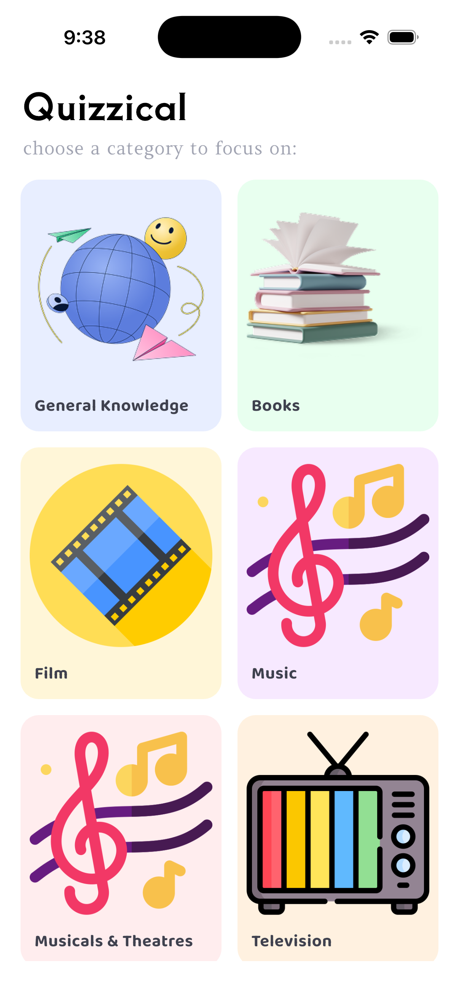

# Quizzical — Flutter Quiz App 🎯

A clean, modular, and scalable **Flutter-based Quiz Application** built using Clean Architecture, GetX state management, and a fully structured layered approach. Powered by the **Open Trivia Database (OpenTDB) API**, Quizzical features dynamic multi-category quizzes, customizable question settings, a real-time interactive timer, and dynamic performance results.

---

## 📖 About

**Quizzical** was designed and developed to deliver a seamless, responsive, and visually appealing trivia experience on mobile devices. The app connects directly to the OpenTDB REST API to fetch up-to-date quiz categories and questions across diverse fields including General Knowledge, Science, Computers, Mathematics, History, Art, and Sports.

Built with strict adherence to **Clean Architecture** (separating Domain, Data, and Presentation layers) and utilizing **GetX** for high-performance reactive state management and route navigation, the codebase is engineered for testability, scalability, and maintainability.

---

## 🚀 Key Features

- **Personalized Welcome Screen**: Elegant typography, personalized user greeting, and an intuitive entry flow.
- **Dynamic Category Selection**:
  - Live category listing powered by the OpenTDB API (`https://opentdb.com/api_category.php`).
  - Themed pastel cards paired with custom high-definition 3D illustrations.
  - Pull-to-refresh and caching for smooth, zero-flicker re-entries.
  - Robust error handling with an in-app retry banner for offline scenarios.
- **Dynamic Quiz Configuration**:
  - Interactive slider to customize question count (1 to 50, defaulting to 10).
  - Difficulty selection: Any, Easy, Medium, Hard.
  - Question Type selector: Any, Multiple Choice, True / False.
  - Local preferences persistence using `shared_preferences`.
- **Interactive Quiz Gameplay**:
  - 30-second countdown timer per question with visual color-coded warnings.
  - Automatic advance on timeout (marked incorrect).
  - Top `LinearProgressIndicator` tracking quiz completion in real-time.
  - Base64 encoding/decoding and HTML entity decoding for pristine text formatting.
  - Immediate visual feedback highlighting correct answers in green and incorrect selections in red.
  - Exit confirmation dialog with automatic timer pause and resume.
- **Dynamic Results & Analytics**:
  - **High Score (≥ 60%)**: Celebratory confetti illustration and *"Congratulation"* banner.
  - **Low Score (< 60%)**: Encouraging artwork and *"Keep Trying!"* banner.
  - Key performance analytics: Total Score, Correct Count, Accuracy Percentage, and Duration.
  - **Play Again** functionality preserving the previous configuration for instant replay.
- **Multi-Environment Ready**:
  - Independent entrypoints for Development (`main_dev.dart`), Staging (`main_stage.dart`), and Production (`main_prod.dart`).
  - Standard bootstrap entrypoint (`main.dart`) for single-click debugging.

---

## 📌 Tech Stack

- **Flutter:** 3.38.1
- **Dart:** 3.10.0
- **State Management & Routing:** GetX (Controllers, Bindings, Reactive Obx, and Named Routes)
- **Networking:** Dio (Custom `ApiResponse`, logging interceptor, and `ApiChecker`)
- **Local Persistence:** `shared_preferences`
- **Architecture:** Clean Architecture + Feature-First (Domain → Data → Presentation)
- **Unit Testing:** `flutter_test` (Base64 decoding, scoring algorithms, and asset mappings)

---

## 🏗 Project Folder Structure

```
lib/
├── app.dart
├── core/
│   ├── app_config.dart
│   ├── constants/
│   │   ├── app_constants.dart
│   │   └── assets.dart
│   ├── helper/
│   │   └── api_checker.dart
│   ├── interface/
│   │   └── repo_interface.dart
│   ├── theme/
│   │   ├── app_colors.dart
│   │   └── app_text_style.dart
│   └── utils/
│       ├── loader_util.dart
│       └── toast_util.dart
├── data/
│   └── datasource/
│       ├── model/
│       │   ├── api_response.dart
│       │   ├── error_response.dart
│       │   └── response_model.dart
│       └── remote/
│           ├── dio/
│           │   ├── dio_client.dart
│           │   └── logging_interceptor.dart
│           └── exception/
│               └── api_error_handler.dart
├── di_container.dart
├── features/
│   ├── categories/
│   │   ├── domain/
│   │   │   ├── models/
│   │   │   │   └── category_model.dart
│   │   │   ├── repositories/
│   │   │   │   ├── category_repository.dart
│   │   │   │   └── category_repository_interface.dart
│   │   │   └── services/
│   │   │       ├── category_service.dart
│   │   │       └── category_service_interface.dart
│   │   └── presentation/
│   │       ├── bindings/
│   │       │   └── category_page_bindings.dart
│   │       ├── controllers/
│   │       │   └── category_controller.dart
│   │       ├── pages/
│   │       │   └── category_page.dart
│   │       └── widgets/
│   │           └── category_card_widget.dart
│   ├── quiz/
│   │   ├── domain/
│   │   │   ├── models/
│   │   │   │   └── quiz_model.dart
│   │   │   ├── repositories/
│   │   │   │   ├── quiz_repository.dart
│   │   │   │   └── quiz_repository_interface.dart
│   │   │   └── services/
│   │   │       ├── quiz_service.dart
│   │   │       └── quiz_service_interface.dart
│   │   └── presentation/
│   │       ├── bindings/
│   │       │   └── quiz_page_bindings.dart
│   │       ├── controllers/
│   │       │   ├── quiz_controller.dart
│   │       │   └── quiz_play_controller.dart
│   │       ├── pages/
│   │       │   ├── quiz_config_page.dart
│   │       │   ├── quiz_play_page.dart
│   │       │   └── results_page.dart
│   │       └── widgets/
│   │           ├── dropdown_item_widget.dart
│   │           ├── empty_radio_widget.dart
│   │           ├── exit_quiz_dialogue.dart
│   │           ├── option_tile_widget.dart
│   │           ├── result_circle_widget.dart
│   │           └── score_badge_widget.dart
│   └── splash/
│       └── presentation/
│           ├── bindings/
│           │   └── splash_page_binding.dart
│           ├── controllers/
│           │   └── splash_controller.dart
│           ├── pages/
│           │   ├── splash_page.dart
│           │   └── welcome_page.dart
│           └── widgets/
│               └── illustration_widget.dart
├── main.dart
├── main_common.dart
├── main_dev.dart
├── main_prod.dart
├── main_stage.dart
├── routes/
│   └── app_pages.dart
└── shared/
    └── widgets/
        └── primary_button_widget.dart
```

---

## 🖼 Screenshots Walkthrough

### 📌 1. Welcome & Onboarding
*Personalized user greeting with clean typography and seamless entry.*

<p align="center">
  
</p>

---

### 📌 2. Category Selection
*Live categories fetched from OpenTDB API, displayed in themed pastel cards with custom 3D artwork.*

<p align="center">
  
  &nbsp;&nbsp;&nbsp;&nbsp;
  
</p>

---

### 📌 3. Dynamic Quiz Configuration
*Customizable question count slider (1–50), difficulty tier selection, and question type dropdowns with persistence.*

<p align="center">
  
  &nbsp;&nbsp;&nbsp;&nbsp;
  
</p>

---

### 📌 4. Interactive Quiz Gameplay (Multiple Choice)
*Real-time 30s countdown timer, linear progress indicator, and instant answer validation feedback.*

<p align="center">
  
  &nbsp;&nbsp;&nbsp;&nbsp;
  
</p>

---

### 📌 5. Adaptive Quiz Gameplay (True / False)
*Streamlined boolean interface with responsive option cards and real-time state tracking.*

<p align="center">
  
</p>

---

### 📌 6. Dynamic Results & Performance Analytics
*Context-aware results screen featuring celebratory confetti for passing scores (≥ 60%) and encouraging retry feedback for scores below 60%.*

<p align="center">
  
  &nbsp;&nbsp;&nbsp;&nbsp;
  
</p>

---

## ▶️ How to Run the Project

### Prerequisites
- [Flutter SDK](https://docs.flutter.dev/get-started/install) (version `>= 3.0.0`)
- [Dart SDK](https://dart.dev/get-dart) (version `>= 3.0.0`)
- Xcode (for iOS Simulator / device testing) or Android Studio

### Installation

```bash
# Clone the repository
git clone https://github.com/iamnazmulhasan/quizzical.git
cd quizzical

# Fetch dependencies
flutter pub get
```

### Running by Environment Flavor

#### Development
```bash
flutter run --flavor dev -t lib/main_dev.dart
```

#### Staging
```bash
flutter run --flavor stage -t lib/main_stage.dart
```

#### Production
```bash
flutter run --flavor prod -t lib/main_prod.dart
```

#### Standard / iOS Simulator
```bash
flutter run -d ios
```

---

## 🧪 Unit Testing

Run the automated test suite covering models, Base64 decoding, question parsers, and scoring logic:

```bash
flutter test
```

---

## 🧑‍💻 Author

- **Name:** Nazmul Hasan Shipon
- **Email:** nazmulhasan.shipon@outlook.com
- **GitHub:** [@iamnazmulhasan](https://github.com/iamnazmulhasan)

---

## 📄 License

This project is open-source and licensed under the [MIT License](LICENSE).
